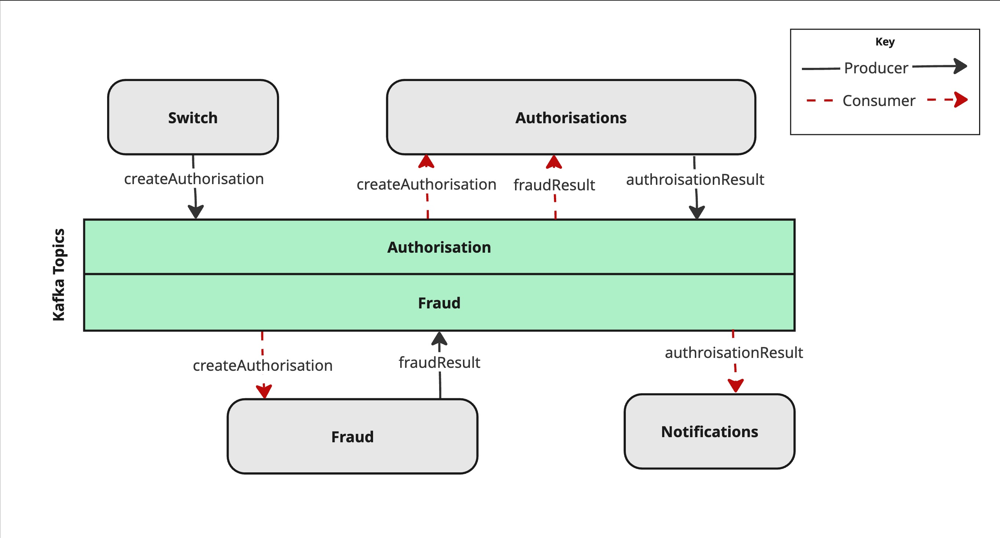

# Authorisation Flow With Kafka

This repository is me testing out how I can use Kafka and associated tooling to create a authorisation flow (from an issuers perspective).

The technology choices are influenced by my 9-5 & therefore are items that I want to tinker with. These include:

* Azure DevOps for CI/CD
* AWS for hosting
* Kafka & a schema registry
* Containerised Spring Boot applications

## Components Involved

In the real world, I'd have a number of microservices performing all kinds of different business logic. This is overkill for my learning though. Instead I'll be using individual components to simulate various microservices. The components involved are:

* **Switch**: An authorisation switch that would typically be accepting authorisations from a scheme (e.g. Mastercard, Visa) and putting them onto a Kafka topic
* **Authorisation**: The main decision engine for if an incoming authorisation is approved or declined
* **Fraud**: A simulation of a system that can screen the incoming transactions for fraud
* **Notifications**: A notification system that can notify external parties of the status of their notifications

